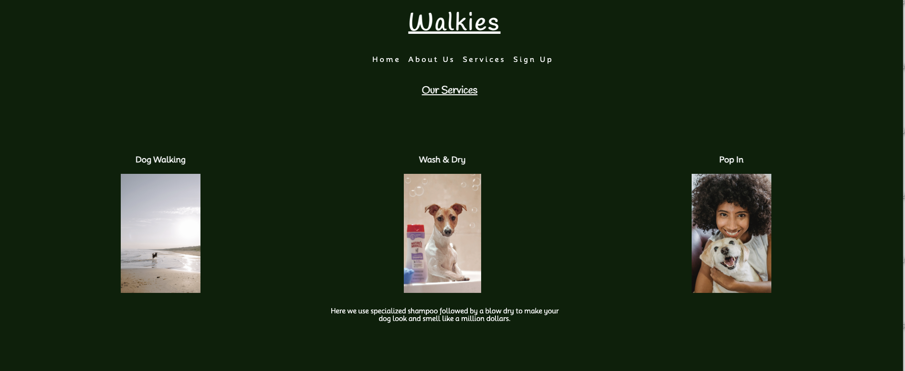

# Walkies
Hello and welcome to Walkies! 

Walkies is a dog walking website that also offers other servcies such as a pop in and a wash and dry service. This website hopes to make the user feel that they know exactly what they are getting by being clear and consise whilst ensuring them that we have the best interests of thier beloved pets at heart.

Walkies is aimed at people with dogs in Gweedore, a beautiful Donegal county surrounded by beaches and amazing outdoor walking environments and will be useful for people who are unable to take their pets on daily walks themselves.

 The live link can be found here [Walkies](https://developerdunne.github.io/Walkies)

  ## *Pallete*

  - I used a colour pallete of white and green which continues throughout the whole website.

  
 
# Technologies

1 HTML - To create basic website.
2 CSS - To style page and give a nice user experience.
3 Balsamiq - To create wireframe.

# Features

### *Navigation*

- At the top of the page you can see the webistes name 'Walkies' and a navigation bar, this clearly tells the user the name of the website and links to other parts of the page.
- When clicked on the 'About Us', 'Services' and 'Sign Up' links each will take you to these different sections of the page.
- The Navigation bar is fixed and will follow down the page so that it is always available.
- When used on mobiles the navigation bar condenses into a burger icon.

 

### *The Home Page*

- The home page shows a large picture of a dog with the website name and the navigation bar which takes you to where you would like to go on the page. 
- It is designed in contrasting colours which is a feature throughout the page.

### *About Us*

- This section gives a brief outline of what the website is about whilst providing some insight into whats available within a table format.

### *Our Services*

- This section breaks down what services are available with a more detailed explaination. 
- It continues to be styled with the white and green contrast to make the information stand out.
- There are 3 tiles, once hovered over each will display more information underneath on that service.

### *Sign Up*

- In this section users can sign up for one of the services described and for further details.

- The form has been designed so that the user cannot submit without providing certin details. It collects the owners data and some of that of the dog.

- The sign up section is valuable as it gives the user the opportunity to show that they are interested in the services.

### *Contact*

- At the bottom of the page there is a Contact heading with a telphone number for queries. Here you can also click on the social links below which will take you to the desired social page, opning in a new tab.

# Testing

- I tested this pages and it worked on Chrome and Safari.

- I tested that the page looked good, all functions worked and was responsive on all standard screen sizes using the devtools toolbar.

- I tested that all navigation links took you to the relevant parts of the page and that social links opened in new tabs.

- I can confirm that the form works and will not allow submission until all relevant information has been submitted.

- I also had other people test the site to ensure I had not missed anything.

## Bugs

### *Solved bugs*

- Before deploying and upon testing I realised that my checkboxes were not working correctly, this is because I had enabled the 'required' action on all of them and so I fixed this so that you only check the ones you require.

- Removing the 'required' action fixed this problem.

### *Unsolved bugs*

- The header when testing responsiveness sometimes overlays to the right, I would hvae liked to resolve this however ran out of time.

# Validator Testing

### *HTML*

- No errors were displayed when putting the code through the official W3C Validator.

### *CSS*

- No errors were displayed when putting the code through the official (Jigsaw) Validator.

### *Accessibility*

- I ran the website through 'Lighthouse in Devtools.

 

 # Deployment

- The site was deployed to Github Pages. The steps to deploy are as follows:
 
  - In the Github repositary, navigate to the settings tab.

  - From the source section drop down menu, select the Master Branch.

  - Once the Master Branch has been selected, the page provided the link to the website.

  - The live link can again be found here [Walkies](https://developerdunne.github.io/Walkies)

  # Credits

### *Content*

  - Some support with code was taken from W3 Schools for the layout of the form and to create the interactive services page.

  - Some support with covertext on home page was taken from the Love Running Project.

  - Issues with Flexbox properties were solved using CSS-Tricks.

### *Media*

  - The image was taken from [Pexels](https://www.pexels.com/)

  - The favicon was tsken from [Favicon.io](https://favicon.io/)

  - The icons were taken from [FontAwesome.com](https://fontawesome.com/)

  - The fonts were taken from [Fonts.google.com](https://fonts.google.com/)

  - The image of what the website looks on different devices was taken from [Am I Responsive?](https://ui.dev/amiresponsive) 

# Acknowledgements

- Ideas were taken from the Code Institute's Coffee House and Love Running projects.
- My mentor, Medale Oluwafemi for his guidance and support.